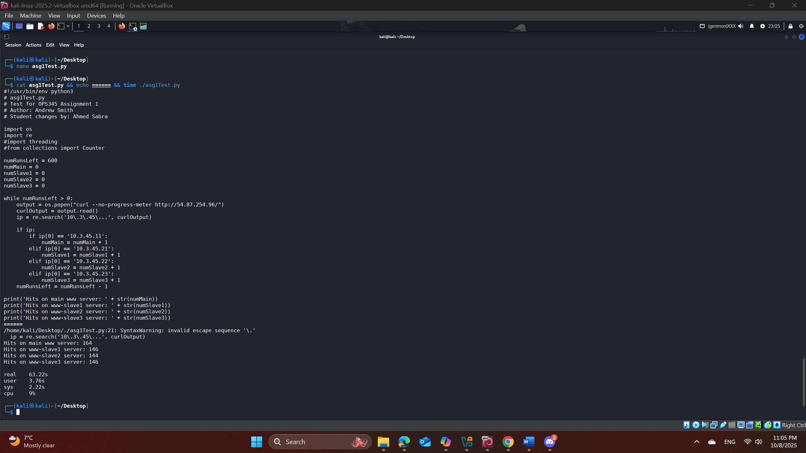
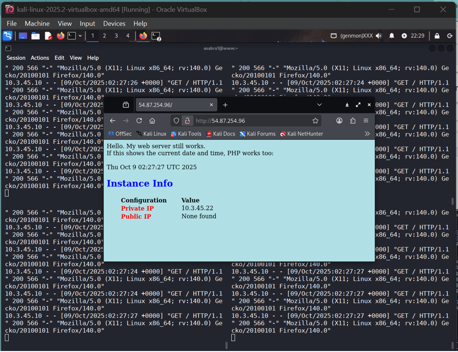

# 🚀 Load Balancer with iptables & Apache OPS345 Assignment 1

A production-like load balancing system built on AWS, distributing traffic across 4 web servers using iptables NAT rules, with automated file synchronization via rsync and cron.


## 🎯 Project Highlights

- **4-server load balancer** using iptables statistical mode
- **Automated file sync** with rsync and cron (5-minute intervals)
- **SSH key authentication** for secure inter-server communication
- **AWS infrastructure** including AMIs, security groups, and NAT
- **Load testing** with custom Python scripts

## 📊 Traffic Distribution
# OPS345 Assignment 1 - Complete Reference Guide
## Load Balancing with iptables & Apache Web Servers

**Author:** Sabra Ahmed  
**Date:** October 8, 2025  
**Course:** OPS345 - Open Source Administration  

---

## Table of Contents
1. [Overview](#overview)
2. [Architecture Diagram](#architecture-diagram)
3. [Part 1: First Slave & File Synchronization](#part-1-first-slave--file-synchronization)
4. [Part 2: iptables Load Balancing (2 Servers)](#part-2-iptables-load-balancing-2-servers)
5. [Part 3: Scaling to 4 Servers](#part-3-scaling-to-4-servers)
6. [Part 4: Load Testing](#part-4-load-testing)
7. [Key Concepts & Commands Reference](#key-concepts--commands-reference)
8. [Troubleshooting Guide](#troubleshooting-guide)
9. [Cleanup Instructions](#cleanup-instructions)

---

## Overview

### What We Built
A basic load balancer using iptables that distributes HTTP traffic across 4 Apache web servers, with automatic file synchronization via rsync and cron.

### Network Topology
- **Router:** 10.3.45.10 (Public IP: 54.87.254.96)
- **www:** 10.3.45.11:80 (Main web server)
- **www-slave1:** 10.3.45.21:80
- **www-slave2:** 10.3.45.22:80
- **www-slave3:** 10.3.45.23:80

### Key Technologies
- **iptables NAT:** For load balancing and port forwarding
- **rsync:** For file synchronization
- **cron:** For automated scheduling
- **SSH keys:** For passwordless authentication
- **AMIs:** For VM cloning

---

## Architecture Diagram

```
Internet
   |
   | (HTTP :80)
   v
[Router] 10.3.45.10 (iptables load balancer)
   |
   |-- 25% --> [www]         10.3.45.11:80
   |-- 25% --> [www-slave1]  10.3.45.21:80
   |-- 25% --> [www-slave2]  10.3.45.22:80
   |-- 25% --> [www-slave3]  10.3.45.23:80
   
   All servers sync /var/www/html via rsync every 5 minutes
   
SSH Port Forwarding:
   :2211 --> www:22
   :2221 --> www-slave1:22
   :2222 --> www-slave2:22
   :2223 --> www-slave3:22
```

## 🛠️ Technologies Used

- **Linux**: Amazon Linux 2023
- **Web Server**: Apache (httpd)
- **Load Balancing**: iptables (DNAT with statistical module)
- **File Sync**: rsync over SSH
- **Automation**: cron
- **Cloud**: AWS EC2, AMIs, EBS, Security Groups
- **Scripting**: Bash, Python

---

## Part 1: First Slave & File Synchronization

### Objective
Create a slave server from www and set up bidirectional file synchronization.

### Step 1: Create AMI from www

**AWS Console Steps:**
1. Navigate to EC2 → Instances
2. Select **www** instance
3. Actions → Image and templates → Create image
4. Image name: `www-for-asg1-p1`
5. Wait for AMI to become "Available" (check under Images → AMIs)

**What this does:**
Creates a snapshot of your entire www server including OS, Apache configuration, and installed packages.

---

### Step 2: Launch www-slave1 from AMI

**AWS Console Steps:**
1. EC2 → Images → AMIs
2. Select `www-for-asg1-p1`
3. Click "Launch instance from AMI"
4. Configure:
   - **Name:** `www-slave1`
   - **Instance type:** t3.micro
   - **Key pair:** ops345-first-key
   - **Network settings:**
     - VPC: vpc-ops345
     - Subnet: subnet-ops345
     - **Primary IP:** `10.3.45.21`
     - **Auto-assign public IP:** Disable
   - **Security group:** ops345wwsg
   - **Storage:** Two volumes (root + data)
5. Launch instance
6. After launch, go to Volumes and rename second volume to `www-data-slave1`

**Important:** Don't change the hostname - it should remain "www" as per assignment instructions.

---

### Step 3: Configure SSH Port Forwarding

**On Router:**
```bash
# SSH into router
ssh -i ~/.ssh/ops345-first-key.pem asabra1@54.87.254.96

# Add port forwarding for slave1
sudo iptables -t nat -A PREROUTING -p tcp --dport 2221 -j DNAT --to-destination 10.3.45.21:22
sudo iptables -A FORWARD -p tcp -d 10.3.45.21 --dport 22 -j ACCEPT

# Save rules
sudo iptables-save | sudo tee /etc/sysconfig/iptables
```

**AWS Security Group:**
1. EC2 → Security Groups → ops345routersg
2. Edit inbound rules
3. Add rule:
   - Type: Custom TCP
   - Port: 2221
   - Source: 0.0.0.0/0 (or your IP)
4. Save rules
## 📸 Screenshots

### Load Balancer in Action


### Load Test Results

**Test SSH access:**
```bash
ssh -i ~/.ssh/ops345-first-key.pem asabra1@54.87.254.96 -p2221

# Verify you're on the right machine
ip addr show | grep "inet 10"
# Should show: 10.3.45.21
```

---## 📸 Screenshots## 📸 Screenshots## 📸 Screenshots

### Load Balancer in Action


### Load Test Results


### Load Balancer in Action


### Load Test Results


### Load Balancer in Action


### Load Test Results


### Step 4: Update Security Group for Internal Communication

**Problem:** Private IPs can't communicate without proper security group rules.

**Solution - Add CIDR rule to ops345wwsg:**
1. EC2 → Security Groups → ops345wwsg
2. Edit inbound rules
3. Add rules:
   - **SSH:** Port 22, Source: 10.3.45.0/24
   - **ICMP:** All ICMP - IPv4, Source: 10.3.45.0/24
4. Save rules

**Why this matters:** Allows all VMs in the 10.3.45.0/24 subnet to SSH and ping each other.

---

### Step 5: Set Up SSH Key Authentication (Passwordless SSH)

**On www-slave1:**
```bash
# SSH into slave1
ssh -i ~/.ssh/ops345-first-key.pem asabra1@54.87.254.96 -p2221

# Generate SSH key for syncing
ssh-keygen -t rsa -f ~/.ssh/id_rsa_wwwsync -N ""

# Display the public key (copy this entire output)
cat ~/.ssh/id_rsa_wwwsync.pub
```

**On www:**
```bash
# SSH into www
ssh -i ~/.ssh/ops345-first-key.pem asabra1@54.87.254.96 -p2211

# Edit authorized_keys file
nano ~/.ssh/authorized_keys

# Paste the public key from slave1 as a NEW LINE at the end
# Save and exit (Ctrl+O, Ctrl+X)
```

**Test passwordless SSH (from slave1):**
```bash
ssh -i ~/.ssh/id_rsa_wwwsync asabra1@10.3.45.11

# Should log in without password prompt!
# Type 'exit' to return to slave1
```

---

### Step 6: Set Up rsync for File Synchronization

**Understanding rsync:**
- `-e "ssh -i ..."`: Use SSH with specific key
- `-a`: Archive mode (preserves permissions, timestamps)
- `-u`: Update only (skip files that are newer on destination)
- `--exclude="nextcloud"`: Don't sync nextcloud directory

**Test rsync FROM www TO slave1:**
```bash
# On www, create a test file
ssh -i ~/.ssh/id_rsa_wwwsync asabra1@10.3.45.11
echo "Hello from www" > /var/www/html/test-from-www.txt
exit

# On slave1, pull the file
rsync -e "ssh -i ~/.ssh/id_rsa_wwwsync" -au --exclude="nextcloud" asabra1@10.3.45.11:/var/www/html/* /var/www/html/

# Check if it synced
ls -la /var/www/html/ | grep test
cat /var/www/html/test-from-www.txt
```

**Test rsync FROM slave1 TO www:**
```bash
# On slave1, create a test file
echo "Hello from slave1" > /var/www/html/test-from-slave1.txt

# Push it to www
rsync -e "ssh -i ~/.ssh/id_rsa_wwwsync" -au --exclude="nextcloud" /var/www/html/* asabra1@10.3.45.11:/var/www/html/

# Verify on www
ssh -i ~/.ssh/id_rsa_wwwsync asabra1@10.3.45.11 "ls -la /var/www/html/ | grep test"
```

---

### Step 7: Install cronie (Cron Service)

**Problem:** Amazon Linux 2023 doesn't have internet access from private IPs by default.

**Solution:** Use temporary Elastic IP

**Steps:**
1. AWS Console → EC2 → Elastic IPs
2. Allocate Elastic IP address
3. Associate with www-slave1
4. SSH directly to the Elastic IP:
   ```bash
   ssh -i ~/.ssh/ops345-first-key.pem asabra1@<ELASTIC_IP>
   sudo dnf install -y cronie
   sudo systemctl enable --now crond
   exit
   ```
5. Disassociate Elastic IP from slave1
6. Associate with www, repeat installation
7. Disassociate and Release Elastic IP

**Verify crond is running:**
```bash
systemctl status crond
```

---

### Step 8: Set Up Cron Jobs for Automatic Syncing

**On www-slave1:**
```bash
# Edit crontab
crontab -e

# Press 'i' to enter insert mode, then add these lines:
*/5 * * * * rsync -e "ssh -i ~/.ssh/id_rsa_wwwsync" -au --exclude="nextcloud" asabra1@10.3.45.11:/var/www/html/* /var/www/html
*/5 * * * * rsync -e "ssh -i ~/.ssh/id_rsa_wwwsync" -au --exclude="nextcloud" /var/www/html/* asabra1@10.3.45.11:/var/www/html

# Press ESC, then type :wq and press ENTER to save
```

**Understanding cron syntax:**
```
*/5 * * * * command
│   │ │ │ │
│   │ │ │ └─── Day of week (0-7, 0 and 7 are Sunday)
│   │ │ └───── Month (1-12)
│   │ └─────── Day of month (1-31)
│   └───────── Hour (0-23)
└─────────────── Minute (0-59)

*/5 = Every 5 minutes
```

**Verify crontab:**
```bash
crontab -l
```

**Test automatic sync:**
1. Create a file on www
2. Wait 5+ minutes
3. Check if it appears on slave1 automatically

---

## Part 2: iptables Load Balancing (2 Servers)

### Objective
Configure router to distribute incoming HTTP traffic 50/50 between www and www-slave1.

---

### Step 1: Backup Current iptables Rules

**On Router:**
```bash
ssh -i ~/.ssh/ops345-first-key.pem asabra1@54.87.254.96

# Create backup
sudo cp /etc/sysconfig/iptables /root/iptables-before-asg1

# Verify backup exists
ls -la /root/iptables-before-asg1
```

**Why this matters:** If you mess up, you can restore with:
```bash
sudo cp /root/iptables-before-asg1 /etc/sysconfig/iptables
sudo systemctl restart iptables
```

---

### Step 2: Understand Current Port 80 Rule

```bash
# View current NAT rules with line numbers
sudo iptables -t nat -L PREROUTING -n --line-numbers

# Look for a rule like:
# 1  DNAT  tcp dpt:80 to:10.3.45.11:80
```

**What this does:** Currently sends 100% of traffic to www.

---

### Step 3: Remove Old Rule and Add Load Balancing Rules

```bash
# Delete the old port 80 rule (replace X with actual line number)
sudo iptables -t nat -D PREROUTING X

# Add first rule: 50% probability to go to www
sudo iptables -t nat -A PREROUTING -p tcp -m tcp --dport 80 -m statistic --mode random --probability 0.5 -j DNAT --to-destination 10.3.45.11:80

# Add second rule: Remaining 50% goes to www-slave1
sudo iptables -t nat -A PREROUTING -p tcp -m tcp --dport 80 -j DNAT --to-destination 10.3.45.21:80

# Save the rules
sudo iptables-save | sudo tee /etc/sysconfig/iptables
```

**How probability works:**
- First rule: 50% of packets match → go to www
- Second rule: Catches remaining 50% → go to slave1
- Result: 50/50 split

**Understanding the command:**
- `-t nat`: Work with NAT table
- `-A PREROUTING`: Append to PREROUTING chain (before routing decision)
- `-p tcp -m tcp --dport 80`: Match TCP packets on port 80
- `-m statistic --mode random --probability 0.5`: 50% random chance
- `-j DNAT --to-destination`: Change destination to specified IP:port

**Reference:** Based on [Yann Klis's iptables load balancing guide](https://www.ykl.io/articles/2013-12-simple-iptables-load-balancing/)

---

### Step 4: Verify Load Balancing Rules

```bash
# Check the rules
sudo iptables -t nat -L PREROUTING -n -v

# Should see something like:
# DNAT  tcp dpt:80 statistic mode random probability 0.50000000000 to:10.3.45.11:80
# DNAT  tcp dpt:80 to:10.3.45.21:80
```

---

### Step 5: Test Load Balancing

**Method 1: Watch Server Logs (Recommended)**

Open two terminal windows side by side:

**Terminal 1 - www logs:**
```bash
ssh -i ~/.ssh/ops345-first-key.pem asabra1@54.87.254.96 -p2211
sudo tail -f /var/log/httpd/access_log
```

**Terminal 2 - slave1 logs:**
```bash
ssh -i ~/.ssh/ops345-first-key.pem asabra1@54.87.254.96 -p2221
sudo tail -f /var/log/httpd/access_log
```

**Method 2: Check IP in Browser**

Open Firefox and visit: `http://54.87.254.96/`

Refresh multiple times (F5). The private IP address shown on the page should alternate between:
- 10.3.45.11 (www)
- 10.3.45.21 (www-slave1)

---

## Part 3: Scaling to 4 Servers

### Objective
Add two more slaves (slave2 and slave3) and update load balancer to distribute traffic 25% to each server.

---

### Step 1: Create AMI from www-slave1

**Why slave1 instead of www?**
slave1 already has:
- SSH keys configured
- rsync commands set up
- Cron jobs running

Cloning slave1 means slave2 and slave3 inherit all this configuration!

**Steps:**
1. EC2 → Instances → www-slave1
2. Actions → Image and templates → Create image
3. Image name: `www-for-asg1-p3`
4. Wait for it to become available

---

### Step 2: Launch www-slave2

**AWS Console:**
1. EC2 → Images → AMIs → Select `www-for-asg1-p3`
2. Launch instance from AMI
3. Configure:
   - **Name:** `www-slave2`
   - **Primary IP:** `10.3.45.22`
   - **Security group:** ops345wwsg
   - Everything else same as slave1
4. Rename second volume to `www-data-slave2`

---

### Step 3: Launch www-slave3

Repeat the same process:
- **Name:** `www-slave3`
- **Primary IP:** `10.3.45.23`
- Rename volume to `www-data-slave3`

---

### Step 4: Set Up SSH Port Forwarding for New Slaves

**On Router:**
```bash
# Port 2222 → slave2
sudo iptables -t nat -A PREROUTING -p tcp --dport 2222 -j DNAT --to-destination 10.3.45.22:22
sudo iptables -A FORWARD -p tcp -d 10.3.45.22 --dport 22 -j ACCEPT

# Port 2223 → slave3
sudo iptables -t nat -A PREROUTING -p tcp --dport 2223 -j DNAT --to-destination 10.3.45.23:22
sudo iptables -A FORWARD -p tcp -d 10.3.45.23 --dport 22 -j ACCEPT

# Save rules
sudo iptables-save | sudo tee /etc/sysconfig/iptables
```

**AWS Security Group:**
Add ports 2222 and 2223 to ops345routersg inbound rules.

**Test SSH access:**
```bash
# Test slave2
ssh -i ~/.ssh/ops345-first-key.pem asabra1@54.87.254.96 -p2222

# Test slave3
ssh -i ~/.ssh/ops345-first-key.pem asabra1@54.87.254.96 -p2223
```

---

### Step 5: Update Load Balancer for 4-Way Distribution

**On Router:**

```bash
# View current rules
sudo iptables -t nat -L PREROUTING -n --line-numbers | grep "dpt:80"

# Delete the two old port 80 rules (delete higher number first!)
sudo iptables -t nat -D PREROUTING <line_number_2>
sudo iptables -t nat -D PREROUTING <line_number_1>

# Add new 4-way load balancing rules
sudo iptables -t nat -A PREROUTING -p tcp -m tcp --dport 80 -m statistic --mode random --probability 0.25 -j DNAT --to-destination 10.3.45.11:80
sudo iptables -t nat -A PREROUTING -p tcp -m tcp --dport 80 -m statistic --mode random --probability 0.33333 -j DNAT --to-destination 10.3.45.21:80
sudo iptables -t nat -A PREROUTING -p tcp -m tcp --dport 80 -m statistic --mode random --probability 0.5 -j DNAT --to-destination 10.3.45.22:80
sudo iptables -t nat -A PREROUTING -p tcp -m tcp --dport 80 -j DNAT --to-destination 10.3.45.23:80

# Save rules
sudo iptables-save | sudo tee /etc/sysconfig/iptables
```

**Understanding the math:**
1. First rule: 25% of all traffic → www
2. Second rule: 33.33% of remaining 75% = 25% → slave1
3. Third rule: 50% of remaining 50% = 25% → slave2
4. Fourth rule: 100% of remaining 25% = 25% → slave3

Result: Each server gets exactly 25% of traffic!

---

### Step 6: Test 4-Way Load Balancing

**Open 4 terminals and watch all server logs:**

```bash
# Terminal 1 - www
ssh -i ~/.ssh/ops345-first-key.pem asabra1@54.87.254.96 -p2211
sudo tail -f /var/log/httpd/access_log

# Terminal 2 - slave1
ssh -i ~/.ssh/ops345-first-key.pem asabra1@54.87.254.96 -p2221
sudo tail -f /var/log/httpd/access_log

# Terminal 3 - slave2
ssh -i ~/.ssh/ops345-first-key.pem asabra1@54.87.254.96 -p2222
sudo tail -f /var/log/httpd/access_log

# Terminal 4 - slave3
ssh -i ~/.ssh/ops345-first-key.pem asabra1@54.87.254.96 -p2223
sudo tail -f /var/log/httpd/access_log
```

Refresh your browser repeatedly - you should see requests appearing randomly across all 4 servers!

---

## Part 4: Load Testing

### Objective
Verify load distribution using a Python script that makes multiple requests and counts which server handles each one.

---

### The Test Script

**Create file:** `~/Desktop/asg1Test.py`

```python
#!/usr/bin/env python3
# asg1Test.py
# Test for OPS345 Assignment 1
# Author: Andrew Smith
# Student changes by: Sabra Ahmed

import os
import re

numRunsLeft = 60
numMain = 0
numSlave1 = 0
numSlave2 = 0
numSlave3 = 0

while numRunsLeft > 0:
    output = os.popen("cur# 🚀 Load Balancer with iptables & Apache

A production-like load balancing system built on AWS, distributing traffic across 4 web servers using iptables NAT rules, with automated file synchronization via rsync and cron.


## 🎯 Project Highlights

- **4-server load balancer** using iptables statistical mode
- **Automated file sync** with rsync and cron (5-minute intervals)
- **SSH key authentication** for secure inter-server communication
- **AWS infrastructure** including AMIs, security groups, and NAT
- **Load testing** with custom Python scripts

## 📊 Traffic Distributionl --no-progress-meter http://54.87.254.96/")
    curlOutput = output.read()
    ip = re.search('10\.3\.45\...', curlOutput)
    
    if ip:
        if ip[0] == '10.3.45.11':
            numMain = numMain + 1
        elif ip[0] == '10.3.45.21':
            numSlave1 = numSlave1 + 1
        elif ip[0] == '10.3.45.22':
            numSlave2 = numSlave2 + 1
        elif ip[0] == '10.3.45.23':
            numSlave3 = numSlave3 + 1
    numRunsLeft = numRunsLeft - 1

print('Hits on main www server: ' + str(numMain))
print('Hits on www-slave1 server: ' + str(numSlave1))
print('Hits on www-slave2 server: ' + str(numSlave2))
print('Hits on www-slave3 server: ' + str(numSlave3))
```

---

### Running the Test

```bash
# Make executable
chmod +x asg1Test.py

# Run the test (with timing)
time python3 ./asg1Test.py
```

**Expected results:**
Each server should get approximately 15 hits (±3 due to randomness).

Example output:
```
Hits on main www server: 14
Hits on www-slave1 server: 16
Hits on www-slave2 server: 15
Hits on www-slave3 server: 15

real    0m12.456s
user    0m1.234s
sys     0m0.567s
```

---

### For Screenshot (Assignment Requirement)

Run this exact command for your submission:
```bash
cat asg1Test.py && echo ======= && time python3 ./asg1Test.py
```

This displays:
1. Your script code
2. A separator line
3. The test results with timing

Take a screenshot of the entire output for **asg1-ss09-script.png**

---

## Key Concepts & Commands Reference

### iptables Basics

**View NAT rules:**
```bash
sudo iptables -t nat -L -n -v
sudo iptables -t nat -L PREROUTING -n --line-numbers
```

**Delete a rule by line number:**
```bash
sudo iptables -t nat -D PREROUTING <line_number>
```

**Save rules:**
```bash
sudo iptables-save | sudo tee /etc/sysconfig/iptables
```

**Restore from backup:**
```bash
sudo iptables-restore < /root/iptables-before-asg1
```

---

### SSH Key Management

**Generate key:**
```bash
ssh-keygen -t rsa -f ~/.ssh/keyname -N ""
```

**View public key:**
```bash
cat ~/.ssh/keyname.pub
```

**Add public key to authorized_keys:**
```bash
# On target machine
nano ~/.ssh/authorized_keys
# Paste public key as new line
```

**Test key authentication:**
```bash
ssh -i ~/.ssh/keyname user@host
```

---

### rsync Commands

**Basic syntax:**
```bash
rsync [options] source destination
```

**Common options:**
- `-a`: Archive mode (preserves permissions, timestamps, etc.)
- `-v`: Verbose output
- `-u`: Update (skip files newer on destination)
- `-e "ssh -i key"`: Use SSH with specific key
- `--exclude="pattern"`: Exclude files/directories
- `--delete`: Delete files on destination not present in source

**Examples:**
```bash
# Pull from remote
rsync -e "ssh -i ~/.ssh/key" -avu user@host:/path/* /local/path/

# Push to remote
rsync -e "ssh -i ~/.ssh/key" -avu /local/path/* user@host:/path/

# With exclusions
rsync -avu --exclude="*.log" --exclude="temp/" /source/ /dest/
```

---

### Cron Syntax

**Format:**
```
* * * * * command
│ │ │ │ │
│ │ │ │ └─── Day of week (0-7, Sunday = 0 or 7)
│ │ │ └───── Month (1-12)
│ │ └─────── Day of month (1-31)
│ └───────── Hour (0-23)
└─────────────── Minute (0-59)
```

**Common patterns:**
```bash
*/5 * * * *     # Every 5 minutes
0 * * * *       # Every hour (at minute 0)
0 0 * * *       # Daily at midnight
0 2 * * 0       # Weekly on Sunday at 2am
0 0 1 * *       # Monthly on 1st at midnight
```

**Manage crontab:**
```bash
crontab -e      # Edit crontab
crontab -l      # List crontab entries
crontab -r      # Remove crontab
```

**View cron logs:**
```bash
sudo journalctl -u crond -f
```

---

### Apache Logs

**Access log location:**
```bash
/var/log/httpd/access_log
```

**Error log location:**
```bash
/var/log/httpd/error_log
```

**Watch logs in real-time:**
```bash
sudo tail -f /var/log/httpd/access_log
```

**Filter logs:**
```bash
# Show only requests from specific IP
sudo grep "192.168.1.100" /var/log/httpd/access_log

# Show only errors
sudo tail /var/log/httpd/error_log

# Count requests per IP
sudo awk '{print $1}' /var/log/httpd/access_log | sort | uniq -c | sort -rn
```

---

### AWS CLI Basics (If Needed)

**List instances:**
```bash
aws ec2 describe-instances --query 'Reservations[*].Instances[*].[InstanceId,PrivateIpAddress,State.Name]' --output table
```

**List volumes:**
```bash
aws ec2 describe-volumes --query 'Volumes[*].[VolumeId,Size,State,Attachments[0].InstanceId]' --output table
```

**List AMIs:**
```bash
aws ec2 describe-images --owners self --query 'Images[*].[ImageId,Name,CreationDate]' --output table
```

---

## Troubleshooting Guide

### Problem: Can't SSH to slave servers

**Check 1: iptables rules on router**
```bash
sudo iptables -t nat -L PREROUTING -n | grep -E "2221|2222|2223"
```

**Check 2: Security group allows ports**
- Go to AWS Console → Security Groups → ops345routersg
- Verify inbound rules have ports 2221, 2222, 2223

**Check 3: VM is actually running**
```bash
# From router
ping 10.3.45.21
ping 10.3.45.22
ping 10.3.45.23
```

---

### Problem: rsync fails with "Permission denied"

**Check 1: SSH key authentication works**
```bash
# From slave1
ssh -i ~/.ssh/id_rsa_wwwsync asabra1@10.3.45.11
# Should log in without password
```

**Check 2: File permissions**
```bash
# On both www and slave
ls -ld /var/www/html
# Should show: drwxr-xr-x ... asabra1 asabra1 ... /var/www/html
```

**Check 3: SSH key has correct permissions**
```bash
ls -la ~/.ssh/id_rsa_wwwsync
# Should show: -rw------- (600)

# Fix if needed:
chmod 600 ~/.ssh/id_rsa_wwwsync
```

---

### Problem: Cron jobs not running

**Check 1: Cron service is running**
```bash
systemctl status crond
```

**Check 2: Crontab is correctly configured**
```bash
crontab -l
# Should show your rsync commands
```

**Check 3: Check cron logs**
```bash
sudo journalctl -u crond -n 50
```

**Check 4: Test commands manually**
```bash
# Run the exact command from crontab
rsync -e "ssh -i ~/.ssh/id_rsa_wwwsync" -au --exclude="nextcloud" asabra1@10.3.45.11:/var/www/html/* /var/www/html
```

**Check 5: Cron environment**
Cron runs with limited environment. Full paths might be needed:
```bash
*/5 * * * * /usr/bin/rsync -e "ssh -i /home/asabra1/.ssh/id_rsa_wwwsync" ...
```

---

### Problem: Load balancer not distributing evenly

**Check 1: iptables rules are correct**
```bash
sudo iptables -t nat -L PREROUTING -n -v | grep "dpt:80"
```

**Check 2: All web servers are running**
```bash
# Test each server from router
curl http://10.3.45.11
curl http://10.3.45.21
curl http://10.3.45.22
curl http://10.3.45.23
```

**Check 3: No duplicate rules**
```bash
# Count port 80 rules
sudo iptables -t nat -L PREROUTING -n | grep "dpt:80" | wc -l
# Should be 4 (one for each server)
```

---

### Problem: File sync not working

**Check 1: Can servers communicate?**
```bash
# From slave1
ping 10.3.45.11
ssh -i ~/.ssh/id_rsa_wwwsync asabra1@10.3.45.11
```

**Check 2: Rsync syntax is correct**
```bash
# Check for typos in crontab
crontab -l

# Common mistakes:
# - Wrong IP address
# - Missing trailing /* in paths
# - Incorrect key path
```

**Check 3: Files exist to sync**
```bash
# Create test file
echo "test" > /var/www/html/synctest.txt

# Wait 5 minutes, then check other server
```

---

### Problem: Can't access website from browser

**Check 1: Port 80 is open on router security group**
- AWS Console → Security Groups → ops345routersg
- Should have: HTTP, Port 80, Source: 0.0.0.0/0

**Check 2: Apache is running on all servers**
```bash
# On each server
sudo systemctl status httpd
```

**Check 3: iptables allows forwarding**
```bash
# On router
sudo iptables -L FORWARD -n | grep "10.3.45"
```

---

## Cleanup Instructions

### After Assignment Submission

**IMPORTANT:** Delete resources to avoid AWS charges!

### Step 1: Delete Slave Instances

1. AWS Console → EC2 → Instances
2. Select: www-slave1, www-slave2, www-slave3
3. Instance state → Terminate instance
4. Confirm termination

**Keep www and router running** - you need these for other assignments!

---

### Step 2: Delete AMIs

1. EC2 → Images → AMIs
2. Select: www-for-asg1-p1 and www-for-asg1-p3
3. Actions → Deregister AMI
4. Confirm

---

### Step 3: Delete Associated Snapshots

1. EC2 → Elastic Block Store → Snapshots
2. Find snapshots created with the AMIs (check dates)
3. Select them
4. Actions → Delete snapshot
5. Confirm

---

### Step 4: Delete EBS Volumes

1. EC2 → Elastic Block Store → Volumes
2. Find volumes from deleted instances (State = "available")
3. These will be:
   - www-data-slave1
   - www-data-slave2
   - www-data-slave3
   - Associated root volumes
4. Select them
5. Actions → Delete volume
6. Confirm

**Don't delete www or router volumes!**

---

### Step 5: Clean Up iptables Rules

**On Router:**
```bash
ssh -i ~/.ssh/ops345-first-key.pem asabra1@54.87.254.96

# Remove slave SSH forwarding rules
sudo iptables -t nat -D PREROUTING -p tcp --dport 2221 -j DNAT --to-destination 10.3.45.21:22
sudo iptables -t nat -D PREROUTING -p tcp --dport 2222 -j DNAT --to-destination 10.3.45.22:22
sudo iptables -t nat -D PREROUTING -p tcp --dport 2223 -j DNAT --to-destination 10.3.45.23:22

# Remove port 80 load balancing rules (keep only www)
sudo iptables -t nat -L PREROUTING -n --line-numbers | grep "dpt:80"
# Note the line numbers, then delete them (highest first):
sudo iptables -t nat -D PREROUTING <line_number>

# Add back simple port 80 forwarding to www
sudo iptables -t nat -A PREROUTING -p tcp --dport 80 -j DNAT --to-destination 10.3.45.11:80

# Save rules
sudo iptables-save | sudo tee /etc/sysconfig/iptables
```

---

### Step 6: Clean Up Security Groups

**Remove unnecessary ports from ops345routersg:**
1. AWS Console → Security Groups → ops345routersg
2. Edit inbound rules
3. Remove ports: 2221, 2222, 2223
4. Keep: 22, 80, 2211
5. Save rules

---

### Cost Saving Tips

**Things that cost money:**
- ✅ Running EC2 instances (charged per hour)
- ✅ EBS volumes (charged per GB per month, even if not attached)
- ✅ Elastic IPs (if allocated but not attached)
- ✅ Snapshots (charged per GB per month)
- ❌ AMIs themselves (free, but snapshots cost money)
- ❌ Security groups (free)
- ❌ iptables rules (free)

**Always delete:**
1. Unused instances immediately
2. Detached EBS volumes
3. Old snapshots
4. Unattached Elastic IPs

---

## Advanced Topics & Extensions

### Real Production Load Balancing

**Why iptables is not used in production:**
1. **No health checks** - Dead servers still receive traffic
2. **No session persistence** - Can't maintain user sessions
3. **Limited algorithms** - Only random distribution
4. **No SSL termination** - Can't handle HTTPS efficiently
5. **Manual scaling** - No automatic server addition/removal

**Professional alternatives:**

**AWS Application Load Balancer (ALB):**
- Automatic health checks
- SSL/TLS termination
- Path-based routing
- WebSocket support
- Integration with Auto Scaling Groups

**HAProxy:**
- Open-source software load balancer
- Multiple algorithms (round-robin, least-connection, etc.)
- Health checks
- Session persistence
- SSL termination

**Nginx:**
- Can act as load balancer
- Very fast
- Also serves as reverse proxy
- Built-in caching

---

### Monitoring & Metrics

**What to monitor in production:**
1. **Response time** - How fast is the server responding?
2. **Throughput** - Requests per second
3. **Error rate** - Percentage of failed requests
4. **Server health** - CPU, memory, disk usage
5. **Network** - Bandwidth utilization
6. **Application logs** - Errors and warnings

**Tools:**
- AWS CloudWatch - Built-in AWS monitoring
- Prometheus + Grafana - Open-source monitoring stack
- New Relic, DataDog - Commercial monitoring services
- ELK Stack (Elasticsearch, Logstash, Kibana) - Log aggregation

---

### Auto Scaling

**Concept:** Automatically add/remove servers based on load.

**AWS Auto Scaling Group setup:**
1. Create Launch Template (like an AMI + configuration)
2. Define Auto Scaling Group:
   - Minimum instances: 2
   - Maximum instances: 10
   - Desired capacity: 4
3. Set scaling policies:
   - Scale up when CPU > 70% for 5 minutes
   - Scale down when CPU < 30% for 10 minutes
4. Attach to Application Load Balancer

**Benefits:**
- Handle traffic spikes automatically
- Save money during low traffic
- Always have redundancy

---

### High Availability

**Concepts for production:**

**Multiple Availability Zones:**
- Run servers in different data centers
- If one data center fails, others continue
- AWS ALB distributes across AZs automatically

**Database Replication:**
- Master-slave database setup
- Read replicas for scaling reads
- Automatic failover

**Shared Storage:**
- Use EFS (Elastic File System) instead of rsync
- All servers see same files instantly
- No sync delays

**Session Management:**
- Use Redis or Memcached for sessions
- Allows any server to handle any user
- "Sticky sessions" in load balancer

---

### Security Improvements

**What's missing from our setup:**

1. **HTTPS/SSL:**
   ```bash
   # Install certbot
   sudo dnf install certbot python3-certbot-apache
   
   # Get certificate
   sudo certbot --apache -d yourdomain.com
   ```

2. **Firewall hardening:**
   - Only allow HTTP from load balancer
   - Only allow SSH from specific IPs
   - Block all other traffic

3. **Fail2ban:**
   - Automatically ban IPs with repeated failed logins
   - Protects against brute force attacks

4. **Web Application Firewall (WAF):**
   - Protects against SQL injection, XSS
   - AWS WAF or CloudFlare

5. **DDoS Protection:**
   - CloudFlare or AWS Shield
   - Rate limiting

---

## Learning Resources

### Books
- **"Linux System Administration Handbook"** - Comprehensive Linux reference
- **"UNIX and Linux System Administration Handbook"** - Industry standard
- **"Web Operations"** - Running reliable web services

### Online Resources
- **Arch Linux Wiki** - Best documentation for any Linux topic
- **DigitalOcean Tutorials** - Excellent step-by-step guides
- **AWS Documentation** - Official AWS docs
- **Reddit /r/sysadmin** - Real-world sysadmin discussions

### Practice
- **AWS Free Tier** - 12 months of free services
- **DigitalOcean** - $200 credit for new users
- **VirtualBox/VMware** - Practice locally
- **Docker** - Learn containerization

---

## Assignment Submission Checklist

### Screenshots Required:

- [ ] **asg1-ss01-amis.png** - AMIs page showing 2 images
- [ ] **asg1-ss02-ebs.png** - Volumes page showing all EBS volumes
- [ ] **asg1-ss03-routersg.png** - ops345routersg security group with ports
- [ ] **asg1-ss04-iptables.png** - `iptables -L -n -t nat` output on router
- [ ] **asg1-ss05-sshkeys.png** - SSH without password from slave to www
- [ ] **asg1-ss06-files.png** - rsync test showing file synchronization
- [ ] **asg1-ss07-crontab.png** - `crontab -l` output on slave
- [ ] **asg1-ss08-firefox.png** - Firefox showing load balancer working (4 tabs with different IPs)
- [ ] **asg1-ss09-script.png** - Python script output with results

### Create Tarball:

```bash
cd ~/Pictures  # or wherever you saved screenshots
tar -czf asg1.tar.gz asg1-ss*.png

# Verify contents
tar -tzf asg1.tar.gz

# Submit asg1.tar.gz to Blackboard
```
### ☕ Support the Project
If this guide helped you, consider supporting my work:  
https://buymeacoffee.com/Asabra1

---

## Final Notes

### What You Learned

**Technical Skills:**
1. Linux system administration
2. Network configuration (iptables, NAT)
3. Automation (cron, rsync)
4. Cloud computing (AWS EC2, AMIs, EBS)
5. Load balancing concepts
6. Security (SSH keys, security groups)

**Soft Skills:**
1. Troubleshooting complex systems
2. Reading technical documentation
3. Problem decomposition
4. Attention to detail

### Real-World Applications

This lab teaches fundamentals used in:
- **DevOps Engineering** - Automation and infrastructure
- **Site Reliability Engineering** - Keeping services running
- **Cloud Architecture** - Designing scalable systems
- **Security Engineering** - Securing infrastructure

### Next Steps

1. **Learn Docker** - Containerization is the future
2. **Learn Kubernetes** - Container orchestration
3. **Learn Terraform** - Infrastructure as Code
4. **Get AWS Certified** - Proves your cloud skills
5. **Build Projects** - Host your own services

---

## Acknowledgments

**Assignment designed by:** Andrew Smith, Seneca College  
**Student:** Sabra Ahmed  
**Course:** OPS345 - Open Source Administration  
**Semester:** Fall 2025  

Special thanks to:
- Yann Klis for the iptables load balancing technique
- The open-source community for amazing tools
- AWS for educational credits

---

## Quick Command Reference Card

### SSH Connections
```bash
# Router
ssh -i ~/.ssh/ops345-first-key.pem asabra1@54.87.254.96

# www (port 2211)
ssh -i ~/.ssh/ops345-first-key.pem asabra1@54.87.254.96 -p2211

# slave1 (port 2221)
ssh -i ~/.ssh/ops345-first-key.pem asabra1@54.87.254.96 -p2221

# slave2 (port 2222)
ssh -i ~/.ssh/ops345-first-key.pem asabra1@54.87.254.96 -p2222

# slave3 (port 2223)
ssh -i ~/.ssh/ops345-first-key.pem asabra1@54.87.254.96 -p2223
```

### Common Troubleshooting
```bash
# Check iptables
sudo iptables -t nat -L -n -v

# Check Apache
sudo systemctl status httpd
sudo tail -f /var/log/httpd/access_log

# Check cron
systemctl status crond
crontab -l
sudo journalctl -u crond -n 50

# Check connectivity
ping 10.3.45.11
curl http://10.3.45.11

# Check file permissions
ls -la /var/www/html
ls -la ~/.ssh/
```

### Emergency Recovery
```bash
# Restore iptables backup
sudo cp /root/iptables-before-asg1 /etc/sysconfig/iptables
sudo systemctl restart iptables

# Restart Apache
sudo systemctl restart httpd

# Restart cron
sudo systemctl restart crond

# Check all services
sudo systemctl list-units --failed
```

---
## 📸 Screenshots

### Load Balancer in Action


### Load Test Results



**END OF REFERENCE GUIDE**

Good luck with your future labs and career in system administration! 🚀
